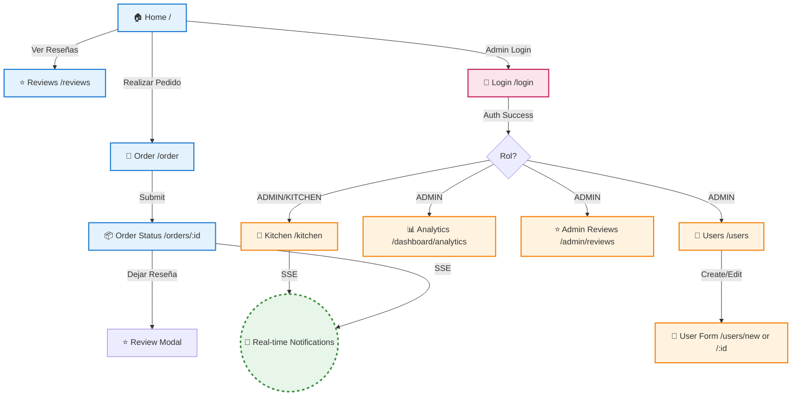

# Documentación del Estado Actual del Frontend - Restaurant Frontend

## 1. Stack Tecnológico

### Framework y Build Tools
- **React:** 19.2.0 (última versión con React Compiler)
- **Build Tool:** Vite 7.2.2 ⚠️ (versión sospechosa, debería ser 5.x)
- **Lenguaje:** JavaScript (ES6+)
- **Package Manager:** npm

### Librerías Principales

| Categoría | Librería | Versión | Estado |
|-----------|----------|---------|--------|
| **Routing** | react-router-dom | 7.9.6 | ✅ Actualizado |
| **Estilos** | TailwindCSS | 3.4.18 | ✅ Actualizado |
| **Autenticación** | Firebase SDK | 12.6.0 | ✅ Actualizado |
| **i18n** | i18next + react-i18next | 25.7.1 / 16.3.5 | ✅ Actualizado |
| **HTTP** | Fetch API nativo | - | Built-in |
| **Encriptación** | bcryptjs | - | Para contraseñas |
| **Testing** | Jest + React Testing Library | 29.7.0 / 16.x | ✅ Actualizado |
| **Mocking** | MSW | 1.3.5 | ⚠️ Desactualizado (existe v2) |

### Herramientas de Desarrollo
- **ESLint:** 9.39.1 (flat config)
- **Babel:** 7.x
- **PostCSS:** 8.5.6 ⚠️ (desactualizado)
- **Docker:** Sí (Dockerfile presente)

---

## 2. Estructura de Carpetas

```
restaurant-frontend/
├── .github/
│   ├── copilot-instructions.md          # Instrucciones para IA
│   ├── copilot-instructions-tests.md    # Guías de testing
│   └── prompts/                         # Prompts reutilizables
│
├── design/                              # Assets de diseño
├── hu/                                  # Historias de Usuario
├── public/                              # Assets estáticos
│
├── src/
│   ├── components/                      # Componentes reutilizables
│   │   ├── analytics/                   # Gráficos y métricas
│   │   │   ├── BarChart.jsx
│   │   │   ├── LineChart.jsx
│   │   │   ├── PieChart.jsx
│   │   │   └── StatCard.jsx
│   │   ├── kitchen/                     # Componentes de cocina
│   │   │   └── OrderCard.jsx
│   │   ├── Login.jsx
│   │   ├── MainLayout.jsx
│   │   ├── NotificationModal.jsx
│   │   ├── ProtectedRoute.jsx
│   │   ├── ReviewModal.jsx
│   │   └── KitchenView.jsx
│   │
│   ├── context/                         # Estado global (Context API)
│   │   └── AuthContext.jsx              # ⚠️ Autenticación simulada
│   │
│   ├── hooks/                           # Custom hooks
│   │   ├── useNotifications.js          # SSE notificaciones
│   │   ├── useOrderFormValidation.js    # Validación formularios
│   │   └── useSalesAnalytics.js         # Estado analíticas
│   │
│   ├── modules/                         # Módulos por feature
│   │   └── users/                       # Gestión de usuarios
│   │       ├── UserForm.jsx
│   │       ├── UserManagement.jsx
│   │       ├── usersService.js
│   │       └── __tests__/
│   │
│   ├── pages/                           # Páginas/vistas principales
│   │   ├── AdminReviewsPage.jsx
│   │   ├── Home.jsx
│   │   ├── Kitchen.jsx
│   │   ├── OrderPage.jsx
│   │   ├── OrderStatusPage.jsx
│   │   └── ReviewsPage.jsx
│   │
│   ├── services/                        # Capa de servicios (API)
│   │   ├── api.js                       # ⚠️ Endpoints principales
│   │   └── analyticsService.js          # ⚠️ DUPLICADO de api.js
│   │
│   ├── styles/                          # Estilos personalizados
│   ├── utils/                           # Utilidades
│   │   └── passwordEncryption.js        # bcryptjs
│   │
│   ├── views/                           # Vistas complejas
│   │   └── SalesAnalyticsDashboard/     # Dashboard modular
│   │
│   ├── locales/                         # Traducciones i18n
│   ├── __tests__/                       # Tests unitarios
│   ├── App.jsx                          # Componente principal
│   ├── main.jsx                         # Entry point
│   ├── i18n.js                          # Configuración i18n
│   └── firebaseConfig.js                # ⚠️ Config Firebase (no usado)
│
├── package.json
├── vite.config.js
├── jest.config.cjs
├── tailwind.config.js
├── Dockerfile
└── README.md
```

### Propósito de Carpetas Clave

- **`components/`**: UI reutilizables (botones, modales, tarjetas)
- **`context/`**: Estado global con Context API (solo autenticación)
- **`hooks/`**: Lógica de negocio encapsulada (analíticas, validaciones, SSE)
- **`modules/`**: Features completos con componentes, servicios y tests
- **`pages/`**: Páginas principales con routing
- **`services/`**: Abstracción de API REST
- **`views/`**: Vistas complejas/compuestas (dashboards)

---

## 3. Componentes Principales y Páginas

### Páginas Principales

| Página | Ruta | Descripción | Protección |
|--------|------|-------------|------------|
| Home.jsx | `/` | Landing page pública | ❌ Público |
| OrderPage.jsx | `/order` | Formulario crear pedido | ❌ Público |
| OrderStatusPage.jsx | `/orders/:orderId` | Tracking estado pedido | ❌ Público |
| ReviewsPage.jsx | `/reviews` | Ver reseñas públicas | ❌ Público |
| Login.jsx | `/login` | Autenticación Firebase | ❌ Público |
| Kitchen.jsx | `/kitchen` | Panel de cocina | ✅ ADMIN/KITCHEN |
| `SalesAnalyticsDashboard` | `/dashboard/analytics` | Dashboard analíticas | ✅ ADMIN |
| UserManagement.jsx | users | CRUD usuarios | ✅ ADMIN |
| UserForm.jsx | `/users/new`, `/users/:id` | Crear/editar usuario | ✅ ADMIN |
| AdminReviewsPage.jsx | `/admin/reviews` | Gestión reseñas | ✅ ADMIN |

### Componentes Reutilizables Clave

**Layouts y Protección:**
- MainLayout.jsx - Layout principal con navegación
- ProtectedRoute.jsx - HOC para rutas protegidas

**UI Compartidos:**
- NotificationModal.jsx - Mensajes/errores al usuario
- ReviewModal.jsx - Modal crear reseña
- KitchenView.jsx - Vista principal cocina
- OrderCard.jsx - Tarjeta pedido cocina

**Analíticas (Componentes Modulares):**
- StatCard.jsx - Tarjeta estadística
- BarChart.jsx - Gráfico barras
- LineChart.jsx - Gráfico líneas
- `PieChart.jsx` - Gráfico circular

---

## 4. Comunicación con el Backend

### Arquitectura de Comunicación

```
┌─────────────────────────────────────────────┐
│         Backend API Gateway                 │
│         http://localhost:3000               │
│         (Variable: VITE_API_URL)            │
└────────────────┬────────────────────────────┘
                 │
         ┌───────┴───────┐
         │               │
    ┌────▼────┐    ┌────▼─────┐
    │ api.js  │    │ users    │
    │         │    │ Service  │
    │ Orders  │    │ .js      │
    │ Kitchen │    └──────────┘
    │ Reviews │
    │Analytics│
    └────▲────┘
         │
    ┌────┴─────────┐
    │ analytics    │
    │ Service.js   │
    │ ⚠️ DUPLICADO │
    └──────────────┘
```

### Servicios HTTP

**Librería:** Fetch API nativo (sin Axios ni otras librerías)

**Archivos de Servicio:**

1. **api.js** - Servicio principal
   - Orders: crear, obtener estado, cancelar
   - Kitchen: listar, obtener, cambiar estados
   - Reviews: crear, obtener, aprobar/ocultar
   - Analytics: obtener datos, exportar CSV

2. **usersService.js** - CRUD usuarios
   - Crear, actualizar, eliminar usuarios
   - Resetear contraseñas
   - Encriptación con bcryptjs

3. **analyticsService.js** - ⚠️ DUPLICADO
   - Wrapper de funciones de `api.js`
   - **PROBLEMA:** Código duplicado innecesario

### Total de Endpoints: 21

| Módulo | Endpoints | Archivo |
|--------|-----------|---------|
| Orders | 3 | api.js |
| Kitchen | 5 | api.js |
| Reviews | 5 | api.js |
| Users | 6 | usersService.js |
| Analytics | 2 | api.js / analyticsService.js |

### Configuración

```javascript
// Variable de entorno
VITE_API_URL = "http://localhost:3000"

// Uso en servicios
const API_BASE_URL = import.meta.env.VITE_API_URL || 'http://localhost:3000';
```

### Características

✅ **URL base centralizada** via env var  
✅ **Manejo robusto de errores** con mensajes específicos  
✅ **Normalización de datos** (ejemplo: estados de pedidos)  
✅ **Descarga de archivos** (CSV export)  
⚠️ **Sin caché** - cada petición va al servidor  
⚠️ **Sin retry automático**  
⚠️ **Sin interceptores** para auth/tokens  

---

## 5. Gestión de Estado y Autenticación

### Estado Global: React Context API

**ÚNICO Context:** AuthContext.jsx

```javascript
// Estado gestionado
{
  isLoggedIn: boolean,
  user: object | null,
  login: (userData) => void,
  logout: () => void
}
```

### ⚠️ PROBLEMA CRÍTICO: Autenticación Simulada

**Estado actual:**
```javascript
// ❌ NO integrado con Firebase
const login = (userData) => {
  setIsLoggedIn(true);
  setUser(userData);
};
```

**Problemas:**
- ❌ NO usa Firebase Auth (solo config en firebaseConfig.js)
- ❌ Sin persistencia de sesión (se pierde al recargar)
- ❌ Sin custom claims (roles)
- ❌ Sin escucha de `onAuthStateChanged`
- ❌ Sin validación real de tokens

### Custom Hooks para Estado Local

**1. useSalesAnalytics.js**
- Estado de analíticas (datos, filtros, loading, error)
- Auto-fetch cuando cambian filtros
- Exportación CSV

**2. useOrderFormValidation.js**
- Validación de formularios
- Estados "touched" de campos
- Validación email/nombre

**3. `useNotifications.js`**
- Conexión SSE (Server-Sent Events)
- Reconexión automática con backoff exponencial
- Filtrado por `orderId`

### Distribución del Estado

```
┌─────────────────────────────────────────┐
│  Estado Global (Context API)            │
│  • Autenticación (simulada)             │
│  • isLoggedIn, user                     │
└─────────────────────────────────────────┘
           ▲
           │
┌──────────┴──────────┬──────────────────┐
│                     │                  │
▼                     ▼                  ▼
Custom Hooks      useState Local     Props
• Analytics       • Forms            • Entre
• Validaciones    • Modales          componentes
• Notificaciones  • UI temporal
```

---

## 6. Flujos de Usuario Principales

### Diagrama de Navegación



### Flujo 1: Cliente - Realizar Pedido

```
1. Home (/) 
   ↓
2. Click "Realizar Pedido" → OrderPage (/order)
   ↓
3. Completar formulario (nombre, email, items)
   ↓ Validación con useOrderFormValidation
4. Submit → POST /orders
   ↓
5. Redirect a OrderStatusPage (/orders/:orderId)
   ↓
6. SSE Connection → useNotifications
   ↓
7. Recibir updates en tiempo real
   ↓ (opcional)
8. Dejar reseña → ReviewModal → POST /reviews
```

### Flujo 2: Cocina - Gestión de Pedidos

```
1. Login (/login) con credenciales KITCHEN/ADMIN
   ↓ AuthContext.login (⚠️ simulado)
2. Redirect a Kitchen (/kitchen)
   ↓
3. GET /kitchen/orders (listar pedidos)
   ↓
4. Filtrar por estado (RECEIVED/PREPARING/READY)
   ↓
5. Acciones en OrderCard:
   • "Iniciar Preparación" → POST /kitchen/orders/:id/start-preparing
   • "Marcar Listo" → POST /kitchen/orders/:id/ready
   ↓
6. SSE → useNotifications (nuevos pedidos)
```

### Flujo 3: Admin - Analíticas

```
1. Login (/login) con rol ADMIN
   ↓
2. Navegar a Analytics (/dashboard/analytics)
   ↓
3. useSalesAnalytics → GET /admin/analytics
   ↓
4. Filtros (fecha, agrupación, top N)
   ↓ updateFilters → auto re-fetch
5. Ver gráficos (BarChart, LineChart, PieChart)
   ↓ (opcional)
6. Exportar CSV → POST /admin/analytics/export
```

### Flujo 4: Admin - Gestión de Usuarios

```
1. Login (/login) con rol ADMIN
   ↓
2. Navegar a Users (/users)
   ↓ GET /users
3. Lista de usuarios (UserManagement)
   ↓
4. Acciones:
   • Crear nuevo → /users/new → UserForm → POST /users
   • Editar → /users/:id → UserForm → PUT /users/:id
   • Desactivar → PATCH /users/:id/disable
   • Eliminar → DELETE /users/:id
   ↓
5. Contraseñas → bcryptjs → passwordEncryption.js
```

---

## 7. Problemas Identificados y Deuda Técnica

### 🔴 CRÍTICO - Alta Prioridad

#### 1. `firebase-admin` en Dependencies
```json
"firebase-admin": "^13.6.0"  // ❌ BACKEND LIBRARY
```
**Problema:**
- Librería de servidor incluida en frontend
- Aumenta bundle ~1.5MB
- **Riesgo de seguridad:** Expone APIs administrativas
- setAdminClaim.cjs usa esta librería

**Solución:**
```bash
npm uninstall firebase-admin
```
Mover setAdminClaim.cjs a un backend/script separado.

#### 2. AuthContext No Funcional
**Archivo:** AuthContext.jsx

**Problemas:**
- ❌ NO integrado con Firebase (solo config en firebaseConfig.js)
- ❌ Autenticación simulada (estado local)
- ❌ Sin persistencia de sesión
- ❌ Sin custom claims (roles)
- ❌ Sin `onAuthStateChanged`

**Impacto:**
- Role-based routing NO funciona realmente
- Se pierde sesión al recargar
- Sin verificación de tokens

**Solución:** Ver sección 8 (Mejoras Recomendadas)

#### 3. Vite 7.2.2 - Versión Incorrecta
```json
"vite": "^7.2.2"  // ⚠️ No existe oficialmente
```
**Problema:**
- Vite 7.x no existe (última estable: 5.4.x)
- Posible typo o versión experimental

**Solución:**
```bash
npm install vite@^5.4.0 --save-dev
```

---

### 🟡 MEDIO - Media Prioridad

#### 4. Código Duplicado en Servicios
**Archivos:**
- api.js - `getAnalytics()`, `exportAnalyticsCSV()`
- analyticsService.js - ⚠️ DUPLICADO

**Problema:**
- Mismas funciones en 2 archivos
- Mantenimiento doble
- Confusión sobre cuál usar

**Solución:**
Eliminar analyticsService.js, usar solo api.js

#### 5. Dependencias Desactualizadas
- **PostCSS:** 8.5.6 (2021) → debería ser 8.4.47
- **MSW:** 1.3.5 → existe v2 con mejoras

**Solución:**
```bash
npm install postcss@^8.4.47
npm install msw@^2.0.0 --save-dev  # Requiere migración
```

#### 6. Sin Gestión de Caché HTTP
**Problema:**
- Fetch nativo sin caché
- Peticiones repetidas van al servidor
- Sin optimistic updates

**Solución:**
Considerar React Query (TanStack Query):
```bash
npm install @tanstack/react-query
```

#### 7. Sin Interceptores HTTP
**Problema:**
- No hay gestión automática de tokens
- Headers de auth manuales
- Sin timeout configurables

**Solución:**
Implementar cliente HTTP centralizado o migrar a Axios.

---

### 🟢 BAJO - Baja Prioridad

#### 8. Sin Custom Hook para AuthContext
```javascript
// Actual: uso directo
const { user, login } = useContext(AuthContext);

// Mejor:
const { user, login } = useAuth();  // Custom hook
```

#### 9. Sin Tests para Componentes Clave
- Varios componentes sin tests en `src/__tests__/`
- Cobertura incompleta

#### 10. Sin Manejo de Errores Global
- Errores manejados componente por componente
- Sin ErrorBoundary global

---

### 📋 Resumen de Deuda Técnica

| Problema | Severidad | Esfuerzo | Impacto |
|----------|-----------|----------|---------|
| firebase-admin en frontend | 🔴 CRÍTICO | Bajo | Alto |
| AuthContext simulado | 🔴 CRÍTICO | Alto | Alto |
| Vite versión incorrecta | 🔴 CRÍTICO | Bajo | Medio |
| Código duplicado servicios | 🟡 MEDIO | Bajo | Medio |
| Dependencies desactualizadas | 🟡 MEDIO | Medio | Bajo |
| Sin caché HTTP | 🟡 MEDIO | Alto | Medio |
| Sin interceptores | 🟡 MEDIO | Medio | Bajo |
| Sin custom hook AuthContext | 🟢 BAJO | Bajo | Bajo |
| Cobertura tests incompleta | 🟢 BAJO | Alto | Medio |
| Sin ErrorBoundary global | 🟢 BAJO | Bajo | Bajo |

---

## 8. Diagrama de Componentes

```mermaid
graph TB
    subgraph "Entry Point"
        Main[main.jsx<br/>🚀 Entrada]
    end

    subgraph "Context Layer - Estado Global"
        AuthContext["AuthContext.jsx<br/>🔐 Auth (⚠️ Simulado)<br/>• isLoggedIn<br/>• user<br/>• login()<br/>• logout()"]
        I18n[i18n.js<br/>🌍 i18next Config]
    end

    subgraph "Routing Layer"
        App["App.jsx<br/>🧭 Router Principal<br/>• Routes<br/>• ProtectedRoutes"]
        MainLayout[MainLayout.jsx<br/>📐 Layout + Nav]
        ProtectedRoute[ProtectedRoute.jsx<br/>🛡️ HOC Auth]
    end

    subgraph "Public Pages - Cliente"
        Home[Home.jsx<br/>🏠 Landing]
        OrderPage[OrderPage.jsx<br/>📝 Crear Pedido]
        OrderStatus[OrderStatusPage.jsx<br/>📦 Tracking Pedido]
        ReviewsPage[ReviewsPage.jsx<br/>⭐ Reseñas Públicas]
    end

    subgraph "Protected Pages - Admin/Kitchen"
        Login[Login.jsx<br/>🔑 Autenticación]
        Kitchen[Kitchen.jsx<br/>🍳 Panel Cocina]
        Analytics[SalesAnalyticsDashboard/<br/>📊 Dashboard Analíticas]
        UserMgmt[UserManagement.jsx<br/>👥 Gestión Usuarios]
        UserForm[UserForm.jsx<br/>📝 Crear/Editar Usuario]
        AdminReviews[AdminReviewsPage.jsx<br/>⭐ Admin Reseñas]
    end

    subgraph "Custom Hooks - Lógica"
        UseSalesAnalytics["useSalesAnalytics.js<br/>📈 Estado Analytics<br/>• data, filters<br/>• loading, error<br/>• updateFilters()<br/>• exportToCSV()"]
        UseNotifications["useNotifications.js<br/>🔔 SSE Connection<br/>• EventSource<br/>• reconnect logic"]
        UseValidation["useOrderFormValidation.js<br/>✅ Validaciones<br/>• touched states<br/>• isValidEmail()<br/>• isFormValid()"]
    end

    subgraph "Services - API Layer"
        ApiService["api.js<br/>🌐 Main Service<br/>• Orders<br/>• Kitchen<br/>• Reviews<br/>• Analytics"]
        UsersService["usersService.js<br/>👤 CRUD Users<br/>• createUser()<br/>• updateUser()<br/>• deleteUser()"]
        AnalyticsService["analyticsService.js<br/>⚠️ DUPLICADO<br/>(wrapper de api.js)"]
    end

    subgraph "Components - UI Reutilizables"
        NotificationModal[NotificationModal.jsx<br/>📢 Mensajes]
        ReviewModal[ReviewModal.jsx<br/>⭐ Modal Reseña]
        KitchenView[KitchenView.jsx<br/>🍳 Vista Cocina]
        OrderCard[OrderCard.jsx<br/>📋 Tarjeta Pedido]
        
        subgraph "Analytics Components"
            StatCard[StatCard.jsx<br/>📊 Estadística]
            BarChart[BarChart.jsx<br/>📊 Gráfico Barras]
            LineChart[LineChart.jsx<br/>📈 Gráfico Líneas]
            PieChart[PieChart.jsx<br/>🥧 Gráfico Circular]
        end
    end

    subgraph "Utils"
        PasswordEncryption[passwordEncryption.js<br/>🔒 bcryptjs]
    end

    subgraph "External Services"
        Firebase["Firebase<br/>🔥 firebaseConfig.js<br/>⚠️ Config sin uso"]
        Backend["Backend API Gateway<br/>🌐 localhost:3000<br/>(VITE_API_URL)"]
        SSEServer["SSE Server<br/>📡 Notifications<br/>localhost:3003"]
    end

    %% Entry Point Connections
    Main -->|Wraps with| AuthContext
    Main -->|Initializes| I18n
    Main -->|Renders| App

    %% Context Connections
    AuthContext -.->|Provides State| Login
    AuthContext -.->|Provides State| Kitchen
    AuthContext -.->|Provides State| UserMgmt
    I18n -.->|Translations| Login
    I18n -.->|Translations| OrderPage

    %% Routing Connections
    App -->|Routes| Home
    App -->|Routes| OrderPage
    App -->|Routes| OrderStatus
    App -->|Routes| ReviewsPage
    App -->|Routes| Login
    App -->|Protected| MainLayout
    
    MainLayout -->|Layout| Kitchen
    MainLayout -->|Layout| Analytics
    MainLayout -->|Layout| UserMgmt
    MainLayout -->|Layout| AdminReviews
    
    ProtectedRoute -->|Wraps| Kitchen
    ProtectedRoute -->|Wraps| Analytics
    ProtectedRoute -->|Wraps| UserMgmt

    %% Pages to Components
    OrderPage -->|Uses| UseValidation
    OrderStatus -->|Uses| UseNotifications
    Kitchen -->|Renders| KitchenView
    Kitchen -->|Uses| UseNotifications
    Analytics -->|Renders| StatCard
    Analytics -->|Renders| BarChart
    Analytics -->|Renders| LineChart
    Analytics -->|Renders| PieChart
    Analytics -->|Uses| UseSalesAnalytics
    UserMgmt -->|Navigates to| UserForm
    OrderStatus -->|Opens| ReviewModal
    
    %% Components Connections
    KitchenView -->|Contains| OrderCard
    ReviewModal -->|Calls| ApiService

    %% Hooks to Services
    UseSalesAnalytics -->|Calls| ApiService
    UseSalesAnalytics -->|⚠️ Also Calls| AnalyticsService
    UseNotifications -->|Connects| SSEServer

    %% Services to External
    ApiService -->|HTTP Fetch| Backend
    UsersService -->|HTTP Fetch| Backend
    UsersService -->|Encrypts| PasswordEncryption
    AnalyticsService -->|⚠️ Duplicates| ApiService

    %% External Services (not used)
    Firebase -.->|⚠️ Not Used| AuthContext

    %% Notifications
    NotificationModal -.->|Used by| OrderPage
    NotificationModal -.->|Used by| UserForm
    NotificationModal -.->|Used by| Kitchen

    %% Styling
    classDef entryPoint fill:#e1f5ff,stroke:#0288d1,stroke-width:3px
    classDef contextClass fill:#fff9c4,stroke:#f57f17,stroke-width:2px
    classDef routingClass fill:#e8f5e9,stroke:#388e3c,stroke-width:2px
    classDef publicPage fill:#f3e5f5,stroke:#7b1fa2,stroke-width:2px
    classDef protectedPage fill:#ffebee,stroke:#c62828,stroke-width:2px
    classDef hookClass fill:#fff3e0,stroke:#e65100,stroke-width:2px
    classDef serviceClass fill:#e0f2f1,stroke:#00796b,stroke-width:2px
    classDef componentClass fill:#fce4ec,stroke:#c2185b,stroke-width:2px
    classDef externalClass fill:#eceff1,stroke:#455a64,stroke-width:2px,stroke-dasharray: 5 5
    classDef problemClass fill:#ffcdd2,stroke:#b71c1c,stroke-width:3px

    class Main entryPoint
    class AuthContext,I18n contextClass
    class App,MainLayout,ProtectedRoute routingClass
    class Home,OrderPage,OrderStatus,ReviewsPage publicPage
    class Login,Kitchen,Analytics,UserMgmt,UserForm,AdminReviews protectedPage
    class UseSalesAnalytics,UseNotifications,UseValidation hookClass
    class ApiService,UsersService serviceClass
    class NotificationModal,ReviewModal,KitchenView,OrderCard,StatCard,BarChart,LineChart,PieChart componentClass
    class Firebase,Backend,SSEServer externalClass
    class AnalyticsService problemClass
```



### Leyenda del Diagrama

| Color | Tipo | Descripción |
|-------|------|-------------|
| 🔵 Azul claro | Entry Point | Punto de entrada (main.jsx) |
| 🟡 Amarillo | Context | Estado global (AuthContext.jsx) |
| 🟢 Verde claro | Routing | Enrutamiento y layouts |
| 🟣 Púrpura | Public Pages | Páginas públicas |
| 🔴 Rojo claro | Protected Pages | Páginas protegidas (admin/kitchen) |
| 🟠 Naranja | Hooks | Custom hooks con lógica |
| 🔷 Verde azulado | Services | Servicios API |
| 🌸 Rosa | Components | Componentes UI |
| ⚫ Gris | External | Servicios externos |
| 🚨 Rojo intenso | Problems | Código problemático |

### Símbolos

- **Líneas sólidas (→):** Dependencias directas
- **Líneas punteadas (⇢):** Uso/consumo de contexto
- **⚠️:** Problema/deuda técnica identificada

---

## 9. Mejoras Recomendadas (Roadmap)

### Fase 1: Fixes Críticos (Sprint 1)

**1. Integrar AuthContext con Firebase Real**

```javascript
// src/context/AuthContext.jsx (MEJORADO)
import { useState, useEffect, createContext, useContext } from 'react';
import { auth } from '../firebaseConfig';
import { 
  signInWithEmailAndPassword, 
  signOut, 
  onAuthStateChanged 
} from 'firebase/auth';

const AuthContext = createContext();

export const useAuth = () => {
  const context = useContext(AuthContext);
  if (!context) throw new Error('useAuth debe usarse dentro de AuthProvider');
  return context;
};

export function AuthProvider({ children }) {
  const [user, setUser] = useState(null);
  const [userRole, setUserRole] = useState(null);
  const [loading, setLoading] = useState(true);

  useEffect(() => {
    const unsubscribe = onAuthStateChanged(auth, async (firebaseUser) => {
      if (firebaseUser) {
        const token = await firebaseUser.getIdTokenResult();
        setUser(firebaseUser);
        setUserRole(token.claims.role || null);
      } else {
        setUser(null);
        setUserRole(null);
      }
      setLoading(false);
    });

    return unsubscribe;
  }, []);

  const login = async (email, password) => {
    const credential = await signInWithEmailAndPassword(auth, email, password);
    return credential.user;
  };

  const logout = () => signOut(auth);

  const value = {
    user,
    userRole,
    isLoggedIn: !!user,
    loading,
    login,
    logout,
  };

  return (
    <AuthContext.Provider value={value}>
      {!loading && children}
    </AuthContext.Provider>
  );
}
```

**2. Remover firebase-admin**
```bash
npm uninstall firebase-admin
```
Mover setAdminClaim.cjs a backend/script separado.

**3. Corregir Versión de Vite**
```bash
npm install vite@^5.4.0 --save-dev
```

---

### Fase 2: Optimizaciones (Sprint 2)

**4. Eliminar Código Duplicado**
- Borrar analyticsService.js
- Usar solo api.js

**5. Actualizar Dependencias**
```bash
npm install postcss@^8.4.47
npm install msw@^2.0.0 --save-dev
npm audit fix
```

**6. Crear Cliente HTTP Centralizado**
```javascript
// src/services/httpClient.js
const API_BASE_URL = import.meta.env.VITE_API_URL || 'http://localhost:3000';

export const httpClient = {
  async request(endpoint, options = {}) {
    const url = `${API_BASE_URL}${endpoint}`;
    
    // Auto-agregar auth token
    const token = await getCurrentUserToken(); // Firebase
    
    const config = {
      ...options,
      headers: {
        'Content-Type': 'application/json',
        ...(token && { 'Authorization': `Bearer ${token}` }),
        ...options.headers,
      },
    };

    const response = await fetch(url, config);
    
    if (!response.ok) {
      const error = await response.json();
      throw new Error(error.message || `HTTP ${response.status}`);
    }
    
    return await response.json();
  },
  
  get: (endpoint) => httpClient.request(endpoint, { method: 'GET' }),
  post: (endpoint, body) => httpClient.request(endpoint, { 
    method: 'POST', 
    body: JSON.stringify(body) 
  }),
  put: (endpoint, body) => httpClient.request(endpoint, { 
    method: 'PUT', 
    body: JSON.stringify(body) 
  }),
  patch: (endpoint, body) => httpClient.request(endpoint, { 
    method: 'PATCH', 
    body: JSON.stringify(body) 
  }),
  delete: (endpoint) => httpClient.request(endpoint, { method: 'DELETE' }),
};
```

---

### Fase 3: Mejoras de DX (Sprint 3)

**7. Integrar React Query**
```bash
npm install @tanstack/react-query
```

```javascript
// src/main.jsx
import { QueryClient, QueryClientProvider } from '@tanstack/react-query';

const queryClient = new QueryClient({
  defaultOptions: {
    queries: {
      staleTime: 5 * 60 * 1000, // 5 min
      cacheTime: 10 * 60 * 1000, // 10 min
      refetchOnWindowFocus: false,
    },
  },
});

root.render(
  <QueryClientProvider client={queryClient}>
    <AuthProvider>
      <App />
    </AuthProvider>
  </QueryClientProvider>
);
```

**8. Error Boundary Global**
```javascript
// src/components/ErrorBoundary.jsx
class ErrorBoundary extends React.Component {
  state = { hasError: false };

  static getDerivedStateFromError(error) {
    return { hasError: true };
  }

  componentDidCatch(error, errorInfo) {
    console.error('Error capturado:', error, errorInfo);
  }

  render() {
    if (this.state.hasError) {
      return <ErrorFallback />;
    }
    return this.props.children;
  }
}
```

**9. Aumentar Cobertura de Tests**
- Tests para Kitchen.jsx
- Tests para `SalesAnalyticsDashboard`
- Tests de integración con MSW 2.x

---

## 10. Comandos Útiles

### Desarrollo
```bash
# Instalar dependencias
npm install

# Iniciar dev server (Vite)
npm run dev
# → http://localhost:5173

# Build de producción
npm run build

# Preview del build
npm run preview
```

### Testing
```bash
# Ejecutar tests
npm test

# Tests con cobertura
npm test -- --coverage

# Tests en watch mode
npm test -- --watch
```

### Docker
```bash
# Build imagen
docker build -t restaurant-frontend .

# Ejecutar contenedor
docker run -p 5173:80 restaurant-frontend
```

### Linting
```bash
# Lint con ESLint
npm run lint

# Fix automático
npm run lint -- --fix
```

---

## 11. Variables de Entorno

Crear archivo `.env` en la raíz del proyecto:

```env
# Backend API
VITE_API_URL=http://localhost:3000

# SSE Notifications
VITE_NOTIFICATION_URL=http://localhost:3003/notifications/stream

# Firebase (ejemplo)
VITE_FIREBASE_API_KEY=your-api-key
VITE_FIREBASE_AUTH_DOMAIN=your-project.firebaseapp.com
VITE_FIREBASE_PROJECT_ID=your-project-id
```

---

## 12. Conclusiones

### ✅ Fortalezas del Proyecto

1. **Arquitectura Modular:** Separación clara de responsabilidades
2. **React 19:** Última versión con React Compiler
3. **Custom Hooks:** Lógica de negocio bien encapsulada
4. **TailwindCSS:** Estilos utility-first modernos
5. **Testing Setup:** Jest + RTL configurados
6. **Docker Ready:** Containerización para deployment
7. **i18n Support:** Internacionalización lista

### ⚠️ Áreas Críticas de Mejora

1. **Autenticación Simulada:** AuthContext NO integrado con Firebase
2. **firebase-admin en Frontend:** Librería backend incluida incorrectamente
3. **Código Duplicado:** analyticsService.js replica funcionalidad de api.js
4. **Sin Caché HTTP:** Cada petición va al servidor
5. **Vite Versión Incorrecta:** 7.2.2 no existe oficialmente

### 📊 Métricas del Proyecto

| Métrica | Valor |
|---------|-------|
| **Componentes** | ~20+ |
| **Páginas** | 10 |
| **Custom Hooks** | 3 |
| **Servicios API** | 21 endpoints |
| **Contexts** | 1 (AuthContext) |
| **Dependencies** | ~30 (producción + dev) |
| **Bundle Size** | ⚠️ Inflado por firebase-admin |

---
**Versión del documento:** 1.0