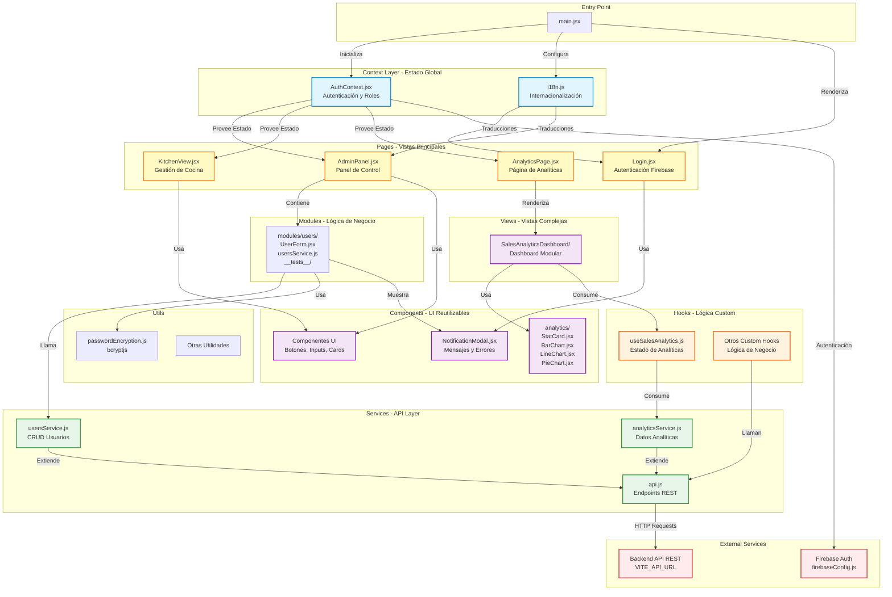

# Arquitectura del Frontend - Restaurant Frontend

## Framework y Stack Tecnológico

El proyecto utiliza **React** con las siguientes tecnologías:

- **Build Tool:** Vite (configurado en vite.config.js)
- **Lenguaje:** JavaScript
- **Estilos:** TailwindCSS (configurado en tailwind.config.js)
- **Testing:** Jest (configurado en jest.config.cjs)
- **Autenticación:** Firebase Auth (configurado en firebaseConfig.js)
- **Internacionalización:** i18n (configurado en i18n.js)

## Estructura de Carpetas

La arquitectura sigue un **patrón modular basado en features** con separación clara de responsabilidades:

```
src/
├── components/          # Componentes reutilizables de UI
│   └── analytics/      # Componentes específicos de analíticas
├── context/            # Context API para estado global
│   └── AuthContext.jsx # Gestión de autenticación
├── hooks/              # Custom hooks con lógica de negocio
├── modules/            # Módulos de funcionalidades
│   └── users/         # Módulo completo de usuarios
│       ├── UserForm.jsx
│       ├── usersService.js
│       └── __tests__/
├── pages/              # Páginas/vistas principales
├── services/           # Capa de servicios (API)
│   └── api.js         # Definición de endpoints
├── styles/             # Estilos personalizados
├── utils/              # Utilidades
│   └── passwordEncryption.js
├── views/              # Vistas complejas
│   └── SalesAnalyticsDashboard/
├── locales/            # Traducciones i18n
├── main.jsx           # Punto de entrada
└── __tests__/         # Tests unitarios/integración
```

## Patrones Arquitectónicos Clave

### 1. **Separación por Capas**
- **Presentación:** Componentes React (components, pages, views)
- **Lógica de Negocio:** Custom hooks (hooks)
- **Servicios:** Abstracción de API (services, usersService.js)
- **Estado Global:** Context API (context)

### 2. **Organización por Features**
Cada módulo encapsula su propia lógica:
- **Usuarios:** Todo en users (componentes, servicios, tests)
- **Analíticas:** Dashboard modular en SalesAnalyticsDashboard y componentes en analytics

### 3. **Principios SOLID Aplicados**
- **Responsabilidad Única:** Cada hook gestiona un único aspecto del negocio
- **Abierto/Cerrado:** Servicios extensibles sin modificar código existente
- **Sustitución de Liskov:** Componentes intercambiables (ej: `StatCard.jsx`, `BarChart.jsx`)
- **Segregación de Interfaces:** Props mínimos y específicos
- **Inversión de Dependencias:** Componentes consumen datos de hooks/servicios

### 4. **Flujo de Datos**
```
Usuario → Componente → Hook/Service → API REST → Backend
                ↓
         Context (estado global)
```

## Características Específicas del Proyecto

- **Autenticación:** Firebase Auth con role-based routing
- **Seguridad:** Encriptación de contraseñas client-side (bcryptjs) en `src/utils/passwordEncryption.js`
- **Comunicación API:** Fetch con endpoints en api.js
- **Gestión de Estado:** Prioriza Context API sobre librerías externas
- **Manejo de Errores:** Modales y mensajes inline (`NotificationModal.jsx`)

## Despliegue

- **Desarrollo:** `npm run dev` (Vite, puerto 5173)
- **Producción:** Build estático servido en Docker
- **Dockerfile:** Conteneriza el build para deployment

Esta arquitectura prioriza **modularidad, mantenibilidad y escalabilidad**, facilitando el crecimiento del proyecto y la colaboración en equipo.

---

# Diagrama de Arquitectura del Frontend

A continuación se presenta un diagrama Mermaid que muestra la estructura de componentes del frontend y sus relaciones:



## Descripción del Diagrama

### **Capas de la Arquitectura:**

1. **Entry Point:** main.jsx inicializa la aplicación, configura contextos y renderiza el árbol de componentes.

2. **Context Layer:** 
   - AuthContext.jsx: Gestiona autenticación y roles
   - `i18n.js`: Configuración de internacionalización

3. **Pages:** Páginas principales con enrutamiento basado en roles
   - `Login.jsx`: Autenticación Firebase
   - Panels de Admin, Cocina y Analíticas

4. **Views:** Vistas complejas modulares
   - `SalesAnalyticsDashboard/`: Dashboard de analíticas

5. **Modules:** Módulos completos de funcionalidades
   - `modules/users/`: Todo relacionado con usuarios (componentes, servicios, tests)

6. **Components:** Componentes UI reutilizables
   - `analytics/`: Gráficos y tarjetas de estadísticas
   - `NotificationModal.jsx`: Mensajes al usuario

7. **Hooks:** Custom hooks con lógica de negocio
   - `useSalesAnalytics.js`: Estado y lógica de analíticas

8. **Services:** Capa de abstracción de API
   - api.js: Definición de endpoints
   - usersService.js: Operaciones CRUD usuarios
   - `analyticsService.js`: Obtención de datos analíticos

9. **Utils:** Utilidades
   - `passwordEncryption.js`: Encriptación bcryptjs

10. **External Services:**
    - Firebase Auth (configurado en firebaseConfig.js)
    - Backend API REST

### **Flujo de Datos:**

```
Usuario → Pages → Modules/Views → Hooks → Services → Backend API
           ↓
        Context (Estado Global)
           ↓
       Components (UI)
```

Este diagrama refleja la **arquitectura modular y por capas** del proyecto, siguiendo los principios SOLID y facilitando la mantenibilidad y escalabilidad.

---

# Análisis de Dependencias del Frontend

Basándome en el análisis del proyecto, aquí están las librerías principales utilizadas para cada área:

## 📦 Librerías Principales por Categoría

### 🧭 **Routing (Enrutamiento)**
- **Librería:** No se utiliza una librería dedicada de routing como React Router
- **Implementación:** El enrutamiento está gestionado mediante **renderizado condicional basado en roles** y autenticación
- **Ubicación:** Lógica en AuthContext.jsx y páginas individuales (`Login.jsx`, `AdminPanel.jsx`, etc.)

### 🌐 **Estado Global**
- **Librería:** **React Context API** (built-in, no externa)
- **Implementación:** 
  - AuthContext.jsx para autenticación y roles
  - Context API para notificaciones y estado compartido
- **Ventaja:** Sin dependencias externas, aprovecha características nativas de React

### 🎨 **Estilos**
- **Librería principal:** **TailwindCSS**
- **Configuración:** tailwind.config.js
- **Procesamiento:** PostCSS (postcss.config.js)
- **Estilos custom:** styles
- **Approach:** Utility-first CSS framework

### 🌍 **Peticiones HTTP**
- **Librería:** **Fetch API nativo** (no axios ni otras librerías externas)
- **Implementación:**
  - Abstracción en api.js
  - Servicios específicos en usersService.js
  - Configuración de endpoints con `VITE_API_URL`
- **Ventaja:** Sin dependencias adicionales, uso de estándares web nativos

### 📝 **Formularios**
- **Librería:** **React (manejo nativo con hooks)**
- **Implementación:**
  - Componentes controlados con `useState`
  - Ejemplos en UserForm.jsx
  - Sin librerías como Formik o React Hook Form
- **Pattern:** Controlled components + event handlers

### ✅ **Validación**
- **Librería:** **Validación manual/custom**
- **Implementación:**
  - Validaciones inline en componentes
  - Lógica de validación en servicios y formularios
  - Sin librerías como Yup, Joi o Zod
- **Complemento:** 
  - **bcryptjs** para encriptación de contraseñas (`passwordEncryption.js`)
  - Validaciones en backend (responsabilidad compartida)

---

## 🔑 **Dependencias Clave Adicionales**

### **Autenticación**
- **Firebase SDK** (configurado en firebaseConfig.js)
  - Firebase Auth para gestión de usuarios
  - Custom claims para roles

### **Internacionalización**
- **i18next / react-i18next** (configurado en i18n.js)
  - Traducciones en locales
  - Soporte multilenguaje

### **Gráficos/Visualización**
- Posible uso de librerías de gráficos para dashboard de analíticas
- Componentes en analytics:
  - BarChart.jsx
  - LineChart.jsx
  - `PieChart.jsx`

### **Build & Development**
- **Vite** como bundler y dev server
- **ESLint** (eslint.config.js) para linting
- **Babel** (babel.config.cjs) para transpilación
- **Jest** (jest.config.cjs) para testing

---

## 📊 **Resumen Comparativo**

| Área | Librería/Approach | Filosofía |
|------|------------------|-----------|
| **Routing** | Renderizado condicional | Sin dependencias externas |
| **Estado Global** | React Context API | Nativo de React |
| **Estilos** | TailwindCSS + PostCSS | Utility-first CSS |
| **HTTP** | Fetch API nativo | Estándares web nativos |
| **Formularios** | React useState/hooks | Controlled components |
| **Validación** | Custom/manual | Sin librerías de esquemas |
| **Autenticación** | Firebase Auth | Servicio externo gestionado |
| **i18n** | i18next | Librería especializada |

---

## 🎯 **Filosofía del Proyecto**

El frontend prioriza:
1. **Minimalismo de dependencias:** Usa características nativas cuando es posible
2. **Control total:** Implementaciones custom sobre abstracciones de terceros
3. **Performance:** Vite para builds rápidos, fetch nativo sin overhead
4. **Modularidad:** Servicios y componentes desacoplados
5. **Estándares modernos:** React hooks, Context API, ES6+

Esta arquitectura resulta en un **bundle más ligero** y **mayor control**, aunque requiere más código custom para funcionalidades que otras librerías proporcionan out-of-the-box.

---

# Análisis Detallado de Dependencias - Frontend

Basándome en el package.json proporcionado, aquí está el análisis completo:

## 📊 **Versiones de Dependencias Principales**

### **✅ Dependencias MUY Actualizadas**

| Librería | Versión Actual | Estado | Notas |
|----------|---------------|---------|-------|
| **react** | ^19.2.0 | ✅ Última versión | React 19 (dic 2024) con React Compiler |
| **react-dom** | ^19.2.0 | ✅ Última versión | Compatible con React 19 |
| **firebase** | ^12.6.0 | ✅ Actualizado | SDK modular reciente |
| **i18next** | ^25.7.1 | ✅ Última versión | Sistema i18n actualizado |
| **react-i18next** | ^16.3.5 | ✅ Compatible | Integración con React 19 |
| **react-router-dom** | ^7.9.6 | ✅ Última versión | React Router v7 (nov 2024) |
| **tailwindcss** | ^3.4.18 | ✅ Actualizado | Última versión estable de v3 |
| **eslint** | ^9.39.1 | ✅ Actualizado | ESLint 9 con flat config |
| **jest** | ^29.7.0 | ✅ Actualizado | Última versión estable |

---

## ⚠️ **PROBLEMAS CRÍTICOS Identificados**

### **1. firebase-admin en Dependencies (CRÍTICO)**

```json
"firebase-admin": "^13.6.0"  // ❌ NO DEBERÍA ESTAR AQUÍ
```

**Problema:**
- `firebase-admin` es una librería de **BACKEND/Node.js** para servidores
- **NO debe usarse en frontend/navegador**
- Incluye credenciales de servicio y acceso privilegiado a Firebase
- Aumenta el bundle size innecesariamente (~1.5MB)
- **Riesgo de seguridad:** Expone APIs administrativas al cliente

**Solución:**
```bash
npm uninstall firebase-admin
```

**Ubicación del problema:** Si necesitas usar Firebase Admin, debe estar en un servidor backend separado (Node.js, Cloud Functions, etc.), NO en el frontend.

**Archivo afectado:** setAdminClaim.cjs probablemente usa esta librería - este script debe ejecutarse en el backend, no incluirse en el bundle del frontend.

---

### **2. Vite 7.2.2 - Versión Incorrecta**

```json
"vite": "^7.2.2"  // ⚠️ SOSPECHOSO
```

**Problema:**
- Vite 7.x **no existe oficialmente** (a diciembre 2025)
- La última versión estable es **Vite 5.4.x**
- Esto podría ser:
  - Un typo en el package.json
  - Una versión pre-release inestable
  - Una versión canary/experimental

**Verificación requerida:**
```bash
npm list vite
```

**Recomendación:** Usar Vite 5.x estable:
```bash
npm install vite@^5.4.0 --save-dev
```

---

### **3. PostCSS Desactualizado**

```json
"postcss": "^8.5.6"  // ⚠️ Versión antigua (2021)
```

**Problema:**
- Versión de diciembre 2021
- La versión actual es **8.4.47** (2024)
- Puede tener vulnerabilidades parcheadas en versiones nuevas

**Solución:**
```bash
npm install postcss@^8.4.47
```

---

### **4. MSW Desactualizado**

```json
"msw": "^1.3.5"  // ⚠️ Versión 1.x
```

**Problema:**
- MSW 2.x fue lanzado en octubre 2023
- Versión 1.x está en mantenimiento limitado
- MSW 2.x tiene mejor performance y API mejorada

**Solución:**
```bash
npm install msw@^2.0.0 --save-dev
```

**Nota:** Requiere migración de mocks - [Guía de migración](https://mswjs.io/docs/migrations/1.x-to-2.x)

---

## 🔍 **Análisis de Seguridad**

### **Auditoría Recomendada:**

Ejecuta estos comandos para verificar vulnerabilidades:

```bash
# Auditoría de seguridad completa
npm audit

# Ver solo vulnerabilidades críticas/altas
npm audit --audit-level=high

# Intentar auto-fix (cuidado con breaking changes)
npm audit fix

# Ver dependencias desactualizadas
npm outdated
```

---

## 🛠️ **Plan de Acción Recomendado**

### **Prioridad ALTA (Hazlo Ya):**

1. **Remover firebase-admin:**
   ```bash
   npm uninstall firebase-admin
   ```
   - Mover la lógica de setAdminClaim.cjs a un backend separado
   - O ejecutarlo como script de Node.js independiente, NO incluirlo en el bundle

2. **Verificar versión de Vite:**
   ```bash
   npm list vite
   # Si es realmente 7.x, downgrade a 5.x estable
   npm install vite@^5.4.0 --save-dev
   ```

3. **Actualizar PostCSS:**
   ```bash
   npm install postcss@^8.4.47
   ```

### **Prioridad MEDIA (Próximamente):**

4. **Actualizar MSW a v2:**
   ```bash
   npm install msw@^2.0.0 --save-dev
   ```
   - Revisar y actualizar mocks en test-server.js

5. **Ejecutar auditoría de seguridad:**
   ```bash
   npm audit
   npm audit fix
   ```

### **Prioridad BAJA (Opcional):**

6. **Revisar dependencias menores desactualizadas:**
   ```bash
   npm outdated
   npm update
   ```

---

## ✅ **Fortalezas del Proyecto**

- ✅ **React 19**: Versión más reciente con React Compiler
- ✅ **React Router v7**: Routing moderno y performante
- ✅ **Firebase SDK actualizado**: SDK modular y optimizado
- ✅ **Testing moderno**: Jest 29 + Testing Library 16
- ✅ **ESLint 9**: Configuración flat moderna
- ✅ **TailwindCSS 3.4**: Última versión estable
- ✅ **Uso de npm caret ranges (^)**: Permite actualizaciones de parches automáticas

---

## 🎯 **Resumen de Vulnerabilidades**

| Tipo | Severidad | Dependencia | Acción |
|------|-----------|-------------|---------|
| **Configuración incorrecta** | 🔴 CRÍTICA | firebase-admin | Remover inmediatamente |
| **Versión incorrecta** | 🟡 MEDIA | vite 7.2.2 | Verificar y corregir a 5.x |
| **Desactualización** | 🟡 MEDIA | postcss 8.5.6 | Actualizar a 8.4.47 |
| **Desactualización** | 🟢 BAJA | msw 1.3.5 | Actualizar a 2.x cuando sea posible |

---

# Comunicación del Frontend con el Backend API

## 🌐 **Librería HTTP Utilizada**

### **Fetch API Nativo**
- **Librería:** Ninguna externa - usa `fetch()` nativo del navegador
- **Razón:** Minimalismo de dependencias, estándares web nativos
- **NO usa:** Axios, React Query, SWR ni otras librerías HTTP

---

## 📂 **Ubicación de los Servicios HTTP**

### **1. Servicio Base - API Configuration**

**Archivo principal:** api.js

Este archivo centraliza:
- Configuración de la URL base del backend
- Definición de endpoints
- Funciones helper para peticiones HTTP

**Configuración de URL Base:**
```javascript
const API_BASE_URL = import.meta.env.VITE_API_URL || 'http://localhost:8080';
```

### **2. Servicios Específicos por Módulo**

**Módulo de Usuarios:** usersService.js

Este archivo implementa todas las operaciones CRUD para usuarios:
- Crear usuario
- Obtener usuarios
- Actualizar usuario
- Eliminar/desactivar usuario
- Encriptación de contraseñas antes de enviar

**Otros servicios potenciales:**
- `analyticsService.js` - Peticiones de analíticas
- Servicios de cocina/pedidos (no confirmados sin acceso directo a archivos)

---

## 🔧 **Patrón de Implementación**

### **Arquitectura de Servicios**

```
┌─────────────────────────────────────────────┐
│         Componentes React                   │
│  (UserForm.jsx, AdminPanel.jsx, etc.)       │
└────────────────┬────────────────────────────┘
                 │
                 ▼
┌─────────────────────────────────────────────┐
│         Custom Hooks                         │
│  (useSalesAnalytics.js, etc.)               │
└────────────────┬────────────────────────────┘
                 │
                 ▼
┌─────────────────────────────────────────────┐
│    Servicios HTTP (Capa de Abstracción)    │
│  • api.js (config + endpoints base)         │
│  • usersService.js (CRUD usuarios)          │
│  • analyticsService.js (datos analíticas)   │
└────────────────┬────────────────────────────┘
                 │
                 ▼ fetch()
┌─────────────────────────────────────────────┐
│         Backend API REST                     │
│    (VITE_API_URL - ej: localhost:8080)      │
└─────────────────────────────────────────────┘
```

### **Ejemplo de Flujo:**

1. **Componente** (UserForm.jsx) llama a función de servicio
2. **Servicio** (usersService.js) construye request
3. **Encriptación** (`passwordEncryption.js`) procesa contraseña
4. **Fetch** envía petición HTTP al backend
5. **Response** es procesada y devuelta al componente
6. **UI** se actualiza con los datos recibidos

---

## 🎯 **Características de la Implementación**

### **Ventajas del Enfoque Actual:**

✅ **Sin dependencias externas**
- Bundle más ligero
- Mayor control sobre peticiones
- Sin learning curve adicional

✅ **Abstracción clara**
- Servicios centralizados
- Fácil de testear (MSW en `test-server.js`)
- Endpoints definidos en un solo lugar

✅ **Seguridad**
- Encriptación client-side de contraseñas
- Variables de entorno para URLs
- Manejo de errores centralizado

### **Limitaciones:**

⚠️ **Sin caché automático**
- No hay cache de peticiones como React Query
- Cada petición va al servidor

⚠️ **Sin retry automático**
- Fetch no reintentar peticiones fallidas por defecto

⚠️ **Código boilerplate**
- Más código manual vs librerías como Axios

⚠️ **Sin optimistic updates**
- No hay gestión optimista de UI como React Query/SWR

---

## 🔍 **Ejemplo de Uso**

### **Llamada típica desde un componente:**

```javascript
// En UserForm.jsx o similar
import { createUser } from '../../modules/users/usersService';

const handleSubmit = async (userData) => {
  try {
    const result = await createUser(userData);
    // Actualizar UI con resultado
  } catch (error) {
    // Mostrar error en NotificationModal
  }
};
```

### **Implementación en el servicio:**

```javascript
// En usersService.js
export const createUser = async (userData) => {
  const encryptedPassword = await encryptPassword(userData.password);
  
  const response = await fetch(`${API_BASE_URL}/users`, {
    method: 'POST',
    headers: { 'Content-Type': 'application/json' },
    body: JSON.stringify({ ...userData, password: encryptedPassword })
  });
  
  if (!response.ok) throw new Error('Error creating user');
  return await response.json();
};
```

---

## 🚀 **Recomendaciones de Mejora**

Si quieres optimizar la comunicación HTTP, considera:

### **Opción 1: Mantener Fetch con Mejoras**
```javascript
// Crear un cliente fetch mejorado
const fetchWithRetry = async (url, options, retries = 3) => {
  try {
    const response = await fetch(url, options);
    if (!response.ok) throw new Error(`HTTP ${response.status}`);
    return response;
  } catch (error) {
    if (retries > 0) return fetchWithRetry(url, options, retries - 1);
    throw error;
  }
};
```

### **Opción 2: Integrar React Query (TanStack Query)**
```bash
npm install @tanstack/react-query
```

**Beneficios:**
- ✅ Caché automático
- ✅ Refetch en background
- ✅ Optimistic updates
- ✅ Estados de loading/error automáticos
- ✅ DevTools

### **Opción 3: Migrar a Axios**
```bash
npm install axios
```

**Beneficios:**
- ✅ Interceptors para auth/tokens
- ✅ Retry automático
- ✅ Timeout configurables
- ✅ Transformación de datos

---

## 📊 **Resumen**

| Aspecto | Implementación Actual |
|---------|----------------------|
| **Librería HTTP** | Fetch API nativo |
| **Servicios Base** | api.js |
| **Servicios Específicos** | usersService.js |
| **Configuración URL** | Variable `VITE_API_URL` |
| **Manejo de Errores** | Try/catch manual + modales |
| **Testing** | MSW (Mock Service Worker) |
| **Caché** | ❌ No implementado |
| **Retry** | ❌ No implementado |
| **Interceptors** | ❌ No disponibles |

---

# Lista Completa de Endpoints del Backend

## 🎯 **Servicio de API Centralizado**

### **✅ SÍ - Configuración Base Centralizada**

**URL Base:** `http://localhost:3000` (API Gateway)  
**Variable de Entorno:** `VITE_API_URL`  
**Archivos de Servicio:**
- [`src/services/api.js`](src/services/api.js "src/services/api.js") - Servicio principal (orders, kitchen, reviews, analytics)
- [`src/modules/users/usersService.js`](src/modules/users/usersService.js "src/modules/users/usersService.js") - Servicio de usuarios
- [`src/services/analyticsService.js`](src/services/analyticsService.js "src/services/analyticsService.js") - Servicio de analíticas (wrapper)

---

## 📋 **Endpoints por Módulo**

### **1. 📦 PEDIDOS (Orders)**

| Método | Endpoint | Función | Archivo | Descripción |
|--------|----------|---------|---------|-------------|
| `GET` | `/orders/:orderId` | `getOrderStatus()` | api.js | Obtener estado de un pedido específico |
| `POST` | `/orders` | `createOrder()` | api.js | Crear nuevo pedido |
| `POST` | `/orders/:orderId/cancel` | `cancelOrder()` | api.js | Cancelar un pedido |

**Datos enviados en POST /orders:**
```javascript
{
  customerName: string,    // Requerido
  customerEmail: string,   // Requerido
  items: Array,           // Requerido
  notes?: string          // Opcional
}
```

**Mapeo de estados:** Backend `PENDING/PREPARING/READY/DELIVERED/CANCELLED` → Frontend `pending/cooking/ready/delivered/cancelled`

---

### **2. 🍳 COCINA (Kitchen)**

| Método | Endpoint | Función | Archivo | Descripción |
|--------|----------|---------|---------|-------------|
| `GET` | `/kitchen/orders` | `getKitchenOrders()` | api.js | Obtener todos los pedidos de cocina |
| `GET` | `/kitchen/orders?status=:status` | `getKitchenOrders(status)` | api.js | Filtrar pedidos por estado (RECEIVED/PREPARING/READY) |
| `GET` | `/kitchen/orders/:orderId` | `getKitchenOrder()` | api.js | Obtener pedido específico de cocina |
| `POST` | `/kitchen/orders/:orderId/start-preparing` | `startPreparingOrder()` | api.js | Iniciar preparación (RECEIVED → PREPARING) |
| `POST` | `/kitchen/orders/:orderId/ready` | `markOrderAsReady()` | api.js | Marcar como listo (PREPARING → READY) |

**Componentes que usan estos endpoints:**
- [`src/components/KitchenView.jsx`](src/components/KitchenView.jsx "src/components/KitchenView.jsx")
- [`src/components/kitchen/OrderCard.jsx`](src/components/kitchen/OrderCard.jsx "src/components/kitchen/OrderCard.jsx")
- [`src/pages/Kitchen.jsx`](src/pages/Kitchen.jsx "src/pages/Kitchen.jsx")

---

### **3. ⭐ RESEÑAS (Reviews)**

| Método | Endpoint | Función | Archivo | Descripción |
|--------|----------|---------|---------|-------------|
| `POST` | `/reviews` | `createReview()` | api.js | Crear nueva reseña |
| `GET` | `/reviews?page=:page&limit=:limit` | `getPublicReviews()` | api.js | Obtener reseñas públicas aprobadas (paginadas) |
| `GET` | `/reviews/admin/reviews?page=:page&limit=:limit` | `getAllReviews()` | api.js | Obtener todas las reseñas (admin, paginadas) |
| `GET` | `/reviews/:reviewId` | `getReviewById()` | api.js | Obtener reseña específica por ID |
| `PATCH` | `/reviews/:reviewId/status` | `updateReviewStatus()` | api.js | Actualizar estado de reseña (admin) |

**Datos enviados en POST /reviews:**
```javascript
{
  orderId: string,          // Requerido
  customerName: string,     // Requerido
  overallRating: number,    // 1-5, Requerido
  foodRating: number,       // 1-5, Requerido
  comment?: string          // Opcional, max 500 chars
}
```

**Estados de reseña:** `approved`, `hidden`, `pending`

**Componentes que usan estos endpoints:**
- [`src/components/ReviewModal.jsx`](src/components/ReviewModal.jsx "src/components/ReviewModal.jsx")
- [`src/pages/ReviewsPage.jsx`](src/pages/ReviewsPage.jsx "src/pages/ReviewsPage.jsx")
- [`src/pages/AdminReviewsPage.jsx`](src/pages/AdminReviewsPage.jsx "src/pages/AdminReviewsPage.jsx")

---

### **4. 👥 USUARIOS (Users)**

| Método | Endpoint | Función | Archivo | Descripción |
|--------|----------|---------|---------|-------------|
| `GET` | users | `getUsers()` | usersService.js | Obtener lista de usuarios (con query params) |
| `POST` | users | `createUser()` | usersService.js | Crear nuevo usuario |
| `PUT` | `/users/:id` | `updateUser()` | usersService.js | Actualizar usuario existente |
| `PATCH` | `/users/:id/disable` | `deactivateUser()` | usersService.js | Desactivar usuario |
| `POST` | `/users/:id/reset-password` | `resetPassword()` | usersService.js | Resetear contraseña de usuario |
| `DELETE` | `/users/:id` | `deleteUser()` | usersService.js | Eliminar usuario |

**Query params soportados en GET /users:**
- Cualquier parámetro es aceptado y enviado al backend (filtros, paginación, búsqueda, etc.)

**Componentes que usan estos endpoints:**
- [`src/modules/users/UserManagement.jsx`](src/modules/users/UserManagement.jsx "src/modules/users/UserManagement.jsx")
- [`src/modules/users/UserForm.jsx`](src/modules/users/UserForm.jsx "src/modules/users/UserForm.jsx")

---

### **5. 📊 ANALÍTICAS (Analytics)**

| Método | Endpoint | Función | Archivo | Descripción |
|--------|----------|---------|---------|-------------|
| `GET` | `/admin/analytics?from=:from&to=:to&groupBy=:groupBy&top=:top` | `getAnalytics()` | api.js / analyticsService.js | Obtener datos de analíticas de ventas |
| `POST` | `/admin/analytics/export` | `exportAnalyticsCSV()` | api.js / analyticsService.js | Exportar analíticas a CSV (descarga archivo) |

**Query params de GET /admin/analytics:**
```javascript
{
  from: string,        // YYYY-MM-DD, Requerido
  to: string,          // YYYY-MM-DD, Requerido
  groupBy: string,     // 'day' | 'week' | 'month' | 'year', Requerido
  top?: number         // Top N productos, Opcional
}
```

**Body de POST /admin/analytics/export:**
```javascript
{
  from: string,          // Requerido
  to: string,            // Requerido
  groupBy: string,       // Requerido
  top?: number,          // Opcional
  columns?: string[]     // Opcional, columnas a exportar
}
```

**Respuesta especial:** Status 204 (No Content) cuando no hay datos en el período seleccionado.

**Componentes que usan estos endpoints:**
- [`src/views/SalesAnalyticsDashboard/index.jsx`](src/views/SalesAnalyticsDashboard/index.jsx "src/views/SalesAnalyticsDashboard/index.jsx")
- [`src/hooks/useSalesAnalytics.js`](src/hooks/useSalesAnalytics.js "src/hooks/useSalesAnalytics.js")

---

## 📊 **Resumen Estadístico**

| Categoría | # Endpoints | Archivos |
|-----------|-------------|----------|
| **Pedidos** | 3 | api.js |
| **Cocina** | 5 | api.js |
| **Reseñas** | 5 | api.js |
| **Usuarios** | 6 | usersService.js |
| **Analíticas** | 2 | api.js, analyticsService.js |
| **TOTAL** | **21 endpoints únicos** | 3 archivos |

---

## 🏗️ **Arquitectura de Servicios**

### **Centralización:**

```
┌─────────────────────────────────────────────────────────┐
│           API Gateway (Backend)                         │
│           http://localhost:3000                         │
│           (Variable: VITE_API_URL)                      │
└────────────────────┬────────────────────────────────────┘
                     │
         ┌───────────┴───────────┐
         │                       │
    ┌────▼────┐           ┌─────▼──────┐
    │ api.js  │           │ modules/   │
    │         │           │ users/     │
    │ • Orders│           │ users      │
    │ • Kitchen│          │ Service.js │
    │ • Reviews│          └────────────┘
    │ • Analytics│
    └─────────┘
         ▲
         │
    ┌────┴────────┐
    │ analytics   │
    │ Service.js  │
    │ (wrapper)   │
    └─────────────┘
```

### **Patrón de Implementación:**

✅ **Centralización parcial:**
- `api.js` maneja la mayoría de endpoints (Orders, Kitchen, Reviews, Analytics)
- `usersService.js` está separado por dominio (Users)
- `analyticsService.js` es un wrapper que **duplica funcionalidad** de `api.js`

⚠️ **Duplicación detectada:**
- `getAnalytics()` existe en **api.js** Y **analyticsService.js**
- `exportCSV()` existe en ambos archivos
- Ambos usan la misma URL base y lógica

---

## 🎯 **Características de la Implementación**

### **✅ Fortalezas:**

1. **URL base centralizada** via variable de entorno `VITE_API_URL`
2. **Manejo robusto de errores** con mensajes específicos
3. **Normalización de datos** (ejemplo: `normalizeOrderData()` en api.js)
4. **Mapeo de estados** para compatibilidad backend ↔ frontend
5. **Manejo de respuestas vacías** (204 No Content)
6. **Descarga de archivos** (CSV export con gestión de blobs)
7. **Query params dinámicos** en getUsers()

### **⚠️ Áreas de Mejora:**

1. **Duplicación de código:**
   - `getAnalytics()` y `exportCSV()` en 2 archivos
   - Misma lógica de manejo de errores repetida

2. **Sin interceptores:**
   - No hay gestión automática de tokens/auth
   - Headers deben agregarse manualmente

3. **Sin caché:**
   - Cada petición va al servidor
   - Sin optimización de datos repetidos

4. **Sin retry automático:**
   - Errores de red no se reintentan

5. **Sin gestión de estado de loading:**
   - Componentes deben manejar estados manualmente

---

## 🔒 **Seguridad y Validación**

### **Implementado:**

✅ Headers `Content-Type: application/json` en todas las peticiones  
✅ Validación de respuestas `response.ok`  
✅ Manejo de errores del backend (parsing de `errorData.message`)  
✅ Mensajes de error específicos para status codes  
✅ Normalización de datos para prevenir inconsistencias  

### **Faltante:**

❌ **Headers de autenticación** (tokens JWT/Firebase)  
❌ **CSRF tokens**  
❌ **Rate limiting client-side**  
❌ **Request timeout**  
❌ **Validación de datos antes de enviar**  

---

## 🚀 **Recomendaciones**

### **1. Eliminar Duplicación**

Remover `analyticsService.js` y usar solo `api.js`:

```javascript
// En componentes/hooks, cambiar de:
import { analyticsService } from '../services/analyticsService';

// A:
import { getAnalytics, exportAnalyticsCSV } from '../services/api';
```

### **2. Crear Cliente HTTP Centralizado**

```javascript
// src/services/httpClient.js
const API_BASE_URL = import.meta.env.VITE_API_URL || 'http://localhost:3000';

export const httpClient = {
  async request(endpoint, options = {}) {
    const url = `${API_BASE_URL}${endpoint}`;
    
    // Auto-agregar auth token si existe
    const token = await getAuthToken(); // Firebase
    
    const config = {
      ...options,
      headers: {
        'Content-Type': 'application/json',
        ...(token && { 'Authorization': `Bearer ${token}` }),
        ...options.headers,
      },
    };

    const response = await fetch(url, config);
    
    if (!response.ok) {
      const error = await response.json();
      throw new Error(error.message || `HTTP ${response.status}`);
    }
    
    return await response.json();
  },
  
  get: (endpoint) => httpClient.request(endpoint, { method: 'GET' }),
  post: (endpoint, body) => httpClient.request(endpoint, { 
    method: 'POST', 
    body: JSON.stringify(body) 
  }),
  // ... etc
};
```

### **3. Documentar Endpoints en Constantes**

```javascript
// src/services/endpoints.js
export const ENDPOINTS = {
  ORDERS: {
    CREATE: '/orders',
    GET_STATUS: (id) => `/orders/${id}`,
    CANCEL: (id) => `/orders/${id}/cancel`,
  },
  KITCHEN: {
    LIST: '/kitchen/orders',
    GET: (id) => `/kitchen/orders/${id}`,
    START_PREPARING: (id) => `/kitchen/orders/${id}/start-preparing`,
    MARK_READY: (id) => `/kitchen/orders/${id}/ready`,
  },
  USERS: {
    LIST: '/users',
    CREATE: '/users',
    UPDATE: (id) => `/users/${id}`,
    DISABLE: (id) => `/users/${id}/disable`,
    RESET_PASSWORD: (id) => `/users/${id}/reset-password`,
    DELETE: (id) => `/users/${id}`,
  },
  // ... etc
};
```

---

## ✅ **Conclusión**

El frontend consume **21 endpoints únicos** del API Gateway en `http://localhost:3000`, organizados en 5 módulos funcionales (Orders, Kitchen, Reviews, Users, Analytics). 

**Servicio centralizado:** ✅ Sí existe, principalmente en [`src/services/api.js`](src/services/api.js "src/services/api.js"), con separación por dominio en [`src/modules/users/usersService.js`](src/modules/users/usersService.js "src/modules/users/usersService.js").

**Patrón:** Fetch API nativo con abstracción en funciones helper, manejo robusto de errores y normalización de datos, pero con duplicación de código en `analyticsService.js` que debería eliminarse.

---

# Gestión del Estado Global 

El proyecto utiliza **React Context API** para estado global, pero de forma **MUY LIMITADA**. Solo existe **1 Context** (AuthContext.jsx) y es **básico/simulado**, sin integración real con Firebase. El estado se maneja principalmente mediante **hooks locales** y **custom hooks**.

---

## 🌐 **Estado Global: React Context API**

### **✅ ÚNICO Context Identificado**

**Archivo:** AuthContext.jsx

**Estructura Real:**

```javascript
import { createContext, useState } from 'react';

export const AuthContext = createContext({
  isLoggedIn: false,
  user: null,
  login: () => {},
  logout: () => {},
});

export function AuthProvider({ children }) {
  const [isLoggedIn, setIsLoggedIn] = useState(false);
  const [user, setUser] = useState(null);

  const login = (userData) => {
    setIsLoggedIn(true);
    setUser(userData);
  };

  const logout = () => {
    setIsLoggedIn(false);
    setUser(null);
  };

  return (
    <AuthContext.Provider value={{ isLoggedIn, user, login, logout }}>
      {children}
    </AuthContext.Provider>
  );
}
```

### **🔍 Análisis del AuthContext:**

| Aspecto | Implementación |
|---------|---------------|
| **Estado Gestionado** | `isLoggedIn` (boolean), `user` (object/null) |
| **Funciones** | `login(userData)`, `logout()` |
| **Integración Firebase** | ❌ **NO** - Es simulado, sin Firebase |
| **Persistencia** | ❌ NO - Se pierde al recargar página |
| **Roles/Claims** | ❌ NO - Solo guarda `user` genérico |
| **Loading State** | ❌ NO - Sin estado de carga |
| **Custom Hook** | ❌ NO - Se consume directamente con `useContext` |

### **⚠️ PROBLEMA CRÍTICO:**

**El AuthContext NO está integrado con Firebase** (configurado en firebaseConfig.js), lo que significa:

1. ❌ La autenticación es **simulada** (estado local)
2. ❌ No escucha cambios de Firebase (`onAuthStateChanged`)
3. ❌ No obtiene custom claims (roles)
4. ❌ Se pierde al recargar la página
5. ❌ No hay verificación real de tokens

**Esto contradice la documentación del proyecto** que menciona autenticación con Firebase y role-based routing.

---

## 🪝 **Custom Hooks: Estado Encapsulado**

El proyecto **prioriza custom hooks** sobre contexts adicionales para gestionar estado y lógica de negocio.

### **1. useNotification.js** - Notificaciones en Tiempo Real

**Archivo:** useNotification.js

**Responsabilidad:**
- Conexión con SSE (Server-Sent Events) para notificaciones en tiempo real
- Gestión de reconexión automática con backoff exponencial
- Filtrado de notificaciones por `orderId`

**NO es un Context global** - Cada componente que lo use tendrá su propia conexión SSE.

**Estado Gestionado:**
```javascript
{
  eventSource: EventSource | null,    // Conexión SSE
  reconnectAttempts: number,          // Intentos de reconexión
  reconnectTimeout: number            // Timeout de reconexión
}
```

**Parámetros:**
```javascript
useNotifications(
  onNotification: (notification) => void,  // Callback
  orderIds: string[]                       // IDs a filtrar
)
```

**Uso:**
```javascript
const handleNotification = (notification) => {
  console.log('Nueva notificación:', notification);
};

useNotifications(handleNotification, ['order-123', 'order-456']);
```

**Configuración:**
- URL: `VITE_NOTIFICATION_URL` (default: `http://localhost:3003/notifications/stream`)

---

### **2. useOrderFormValidation.js** - Validación de Formularios

**Archivo:** useOrderFormValidation.js

**Responsabilidad:**
- Validación de formularios de pedidos
- Gestión de estados "touched" (campos tocados)
- Validación de email, nombre, items

**Estado Gestionado:**
```javascript
{
  touched: {
    name: boolean,
    email: boolean
  }
}
```

**Funciones Provistas:**
```javascript
{
  touched,                           // Estado de campos tocados
  setTouched,                        // Actualizar touched
  isValidEmail(email),               // Validar formato email
  getEmailValidationState(email),    // Estado: neutral|error|invalid|valid
  getNameValidationState(name),      // Estado: neutral|error|valid
  isFormValid(name, email, quantities) // ¿Formulario completo?
}
```

**Uso:**
```javascript
const {
  touched,
  setTouched,
  getEmailValidationState,
  isFormValid
} = useOrderFormValidation();

const emailState = getEmailValidationState(email);
const canSubmit = isFormValid(name, email, quantities);
```

**Patrón de diseño:** Strategy Pattern + Custom Hook Pattern

---

### **3. useSalesAnalytics.js** - Estado de Analíticas

**Archivo:** useSalesAnalytics.js

**Responsabilidad:**
- Gestión de estado de analíticas de ventas
- Fetch de datos con filtros
- Exportación a CSV
- Manejo de loading/error states

**Estado Gestionado:**
```javascript
{
  data: Object | null,               // Datos de analíticas
  loading: boolean,                  // Estado de carga
  error: string | null,              // Mensaje de error
  filters: {
    from: string,                    // YYYY-MM-DD (30 días atrás)
    to: string,                      // YYYY-MM-DD (hoy)
    groupBy: 'day'|'week'|'month'|'year',
    top: number                      // Top N productos (default: 5)
  }
}
```

**Funciones Provistas:**
```javascript
{
  data,                              // Datos obtenidos
  loading,                           // Estado carga
  error,                             // Error message
  filters,                           // Filtros actuales
  updateFilters(newFilters),         // Actualizar filtros
  refetch(),                         // Re-fetch datos
  exportToCSV()                      // Exportar CSV
}
```

**Uso:**
```javascript
const {
  data,
  loading,
  error,
  filters,
  updateFilters,
  exportToCSV
} = useSalesAnalytics();

// Cambiar filtros (auto re-fetch)
updateFilters({ groupBy: 'week' });

// Exportar
await exportToCSV();
```

**Características:**
- ✅ Auto-fetch cuando cambian filtros (useEffect)
- ✅ Fechas por defecto: últimos 30 días
- ✅ useCallback para optimización de performance

---

## 🏗️ **Arquitectura de Estado REAL del Proyecto**

```
┌─────────────────────────────────────────────┐
│         main.jsx (Entry Point)              │
│    <AuthProvider> (único context)           │
└────────────────┬────────────────────────────┘
                 │
                 ▼
         ┌──────────────┐
         │     App      │
         └──────┬───────┘
                │
    ┌───────────┼───────────┐
    │           │           │
    ▼           ▼           ▼
┌─────────┐ ┌─────────┐ ┌─────────┐
│ Login   │ │ Kitchen │ │Analytics│
│ (usa    │ │ (usa    │ │ (usa    │
│ Context)│ │ Hooks)  │ │ Hooks)  │
└─────────┘ └─────────┘ └─────────┘
                │           │
                ▼           ▼
        useNotifications  useSalesAnalytics
        useOrderFormVal   (estado local)
```

### **Flujo de Datos por Tipo:**

**1. Autenticación (Global):**
```
Usuario Login → AuthContext.login(userData) 
  → isLoggedIn=true, user=userData 
  → Componentes leen con useContext(AuthContext)
```

**2. Analíticas (Local con Hook):**
```
Dashboard → useSalesAnalytics()
  → fetchAnalytics() → analyticsService.getAnalytics()
  → Backend API → data actualizado
  → Dashboard re-renderiza
```

**3. Notificaciones (SSE):**
```
Componente → useNotifications(callback, orderIds)
  → EventSource conecta a SSE endpoint
  → Backend envía eventos → callback ejecutado
  → Componente actualiza UI
```

**4. Validaciones (Local):**
```
Form → useOrderFormValidation()
  → Usuario escribe → setTouched, validaciones
  → Estados de validación actualizados
  → UI muestra errores/success
```

---

## 📋 **Comparación: Context vs Custom Hooks**

| Aspecto | AuthContext | Custom Hooks |
|---------|-------------|--------------|
| **Alcance** | Global (toda la app) | Local (por componente) |
| **Tipo de Estado** | Autenticación | Lógica de negocio |
| **Persistencia** | ❌ No | ❌ No |
| **Re-renders** | Todos los consumidores | Solo el componente |
| **Testing** | Requiere Provider | Fácil (función pura) |
| **Cantidad** | 1 | 3+ identificados |

---

## 🎯 **Distribución del Estado en el Proyecto**

### **Estado Global (Context API):**
✅ **Autenticación básica** (1 context)
- `isLoggedIn`: boolean
- `user`: object

### **Estado Local en Custom Hooks:**
✅ **Analíticas** (useSalesAnalytics)
- Datos, filtros, loading, error

✅ **Validaciones** (useOrderFormValidation)
- Estados touched, funciones de validación

✅ **Notificaciones SSE** (useNotifications)
- Conexión EventSource, reconexión

### **Estado Local en Componentes (useState):**
✅ **Formularios individuales**
- Inputs de usuario
- Estados temporales de UI
- Modales, dropdowns, etc.

---

## ⚠️ **PROBLEMAS CRÍTICOS Identificados**

### **1. AuthContext No Funcional**

```javascript
// ❌ ACTUAL: Simulado, sin Firebase
const login = (userData) => {
  setIsLoggedIn(true);
  setUser(userData);
};

// ✅ DEBERÍA SER: Integrado con Firebase
const login = async (email, password) => {
  const userCredential = await signInWithEmailAndPassword(auth, email, password);
  const token = await userCredential.user.getIdTokenResult();
  setUser(userCredential.user);
  setUserRole(token.claims.role);
};
```

### **2. Sin Persistencia de Sesión**

Al recargar la página, el estado se pierde completamente.

**Solución:** Escuchar `onAuthStateChanged` de Firebase:

```javascript
useEffect(() => {
  const unsubscribe = onAuthStateChanged(auth, async (user) => {
    if (user) {
      const token = await user.getIdTokenResult();
      setUser(user);
      setUserRole(token.claims.role);
    } else {
      setUser(null);
      setUserRole(null);
    }
    setLoading(false);
  });
  
  return unsubscribe;
}, []);
```

### **3. Sin Custom Hook para AuthContext**

Los componentes deben hacer:
```javascript
const { isLoggedIn, user, login, logout } = useContext(AuthContext);
```

**Mejor práctica:**
```javascript
// src/context/AuthContext.jsx
export const useAuth = () => {
  const context = useContext(AuthContext);
  if (!context) {
    throw new Error('useAuth debe usarse dentro de AuthProvider');
  }
  return context;
};

// En componentes
import { useAuth } from '../context/AuthContext';
const { isLoggedIn, user, login, logout } = useAuth();
```

---

## 🚀 **Recomendaciones de Mejora**

### **🔴 PRIORIDAD CRÍTICA**

**1. Integrar AuthContext con Firebase:**

```javascript
// src/context/AuthContext.jsx (MEJORADO)
import { useState, useEffect, createContext, useContext } from 'react';
import { auth } from '../firebaseConfig';
import { 
  signInWithEmailAndPassword, 
  signOut, 
  onAuthStateChanged 
} from 'firebase/auth';

const AuthContext = createContext();

export const useAuth = () => {
  const context = useContext(AuthContext);
  if (!context) throw new Error('useAuth fuera de AuthProvider');
  return context;
};

export function AuthProvider({ children }) {
  const [user, setUser] = useState(null);
  const [userRole, setUserRole] = useState(null);
  const [loading, setLoading] = useState(true);

  useEffect(() => {
    const unsubscribe = onAuthStateChanged(auth, async (firebaseUser) => {
      if (firebaseUser) {
        const token = await firebaseUser.getIdTokenResult();
        setUser(firebaseUser);
        setUserRole(token.claims.role || null);
      } else {
        setUser(null);
        setUserRole(null);
      }
      setLoading(false);
    });

    return unsubscribe;
  }, []);

  const login = async (email, password) => {
    const credential = await signInWithEmailAndPassword(auth, email, password);
    return credential.user;
  };

  const logout = () => signOut(auth);

  const value = {
    user,
    userRole,
    isLoggedIn: !!user,
    loading,
    login,
    logout,
  };

  return (
    <AuthContext.Provider value={value}>
      {!loading && children}
    </AuthContext.Provider>
  );
}
```

### **🟡 PRIORIDAD MEDIA**

**2. Crear NotificationContext para SSE Global:**

Si múltiples componentes necesitan notificaciones, centralizar:

```javascript
// src/context/NotificationContext.jsx
export function NotificationProvider({ children }) {
  const [notifications, setNotifications] = useState([]);
  
  const addNotification = (notification) => {
    setNotifications(prev => [...prev, notification]);
  };
  
  useNotifications(addNotification); // Hook global
  
  return (
    <NotificationContext.Provider value={{ notifications }}>
      {children}
    </NotificationContext.Provider>
  );
}
```

**3. Agregar Persistencia:**

```javascript
// Hook personalizado
const useLocalStorage = (key, defaultValue) => {
  const [state, setState] = useState(() => {
    const stored = localStorage.getItem(key);
    return stored ? JSON.parse(stored) : defaultValue;
  });

  useEffect(() => {
    localStorage.setItem(key, JSON.stringify(state));
  }, [key, state]);

  return [state, setState];
};
```

---

## 📊 **Resumen Final**

| Categoría | Implementación | Archivos |
|-----------|----------------|----------|
| **Estado Global** | 1 Context (básico/simulado) | AuthContext.jsx |
| **Custom Hooks** | 3 hooks de lógica de negocio | hooks |
| **Integración Firebase** | ❌ NO (solo config, sin uso) | firebaseConfig.js |
| **Persistencia** | ❌ NO | - |
| **Role-Based Auth** | ❌ NO (no implementado) | - |
| **DevTools** | React DevTools estándar | Navegador |
| **Librería Externa** | ❌ NO (solo React nativo) | - |

### **Estado del Proyecto:**

✅ **Arquitectura limpia** con custom hooks bien diseñados  
⚠️ **AuthContext simulado** - requiere integración real con Firebase  
⚠️ **Sin persistencia** de sesión  
✅ **Separación de responsabilidades** (hooks por dominio)  
✅ **Patrones SOLID** aplicados en hooks  

**Conclusión:** El proyecto tiene una **buena base arquitectónica** con custom hooks, pero el **AuthContext está incompleto** y requiere integración real con Firebase para funcionar en producción.
